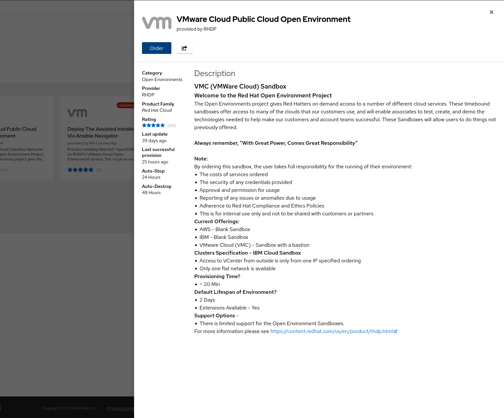
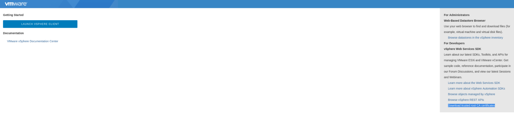
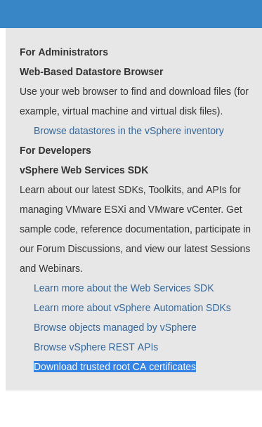

# ACM MIRROR REGISTRY AND ON PREM CLUSTERS

## TABLE OF CONTENTS

* [Introduction](#introduction)
* [Deploying OCP using vSpere IPI on a Connected Environment ](#deploying-ocp-using-vspere-ipi-on-a-connected-environment)


## Introduction

This documents is specific for deploying components in the demo.redhat.com platform.

This project details how to install a Management cluster using vsphere IPI method, in both a connected and disconnected environment.

There is a section on the creation and use of Infra nodes.

The installation and configuration of the mirror registry is explained for the case of the disconnected environment installation. 

The de ployment of managed OCP clusters through ACM "on premisses" has its own section

## Deploying OCP using vSpere IPI on a Connected Environment 

Create 1 **VMware Cloud Public Cloud Open Environment** in demo.redhat.com. 



The environment will be used to deploy an IPI OCP 4.14 cluster hub cluster.

Make sure to enable DNS records creation for OCP. when ordering the environment


It takes about 20 minutes for the environment to be provisioned and ready.
When the environment is ready, an email is received with information on how to access it.

Ssh into the bastion node and verify the DNS records for the cluster:

```
$ dig +short api.glnm2.dynamic.opentlc.com
3.223.59.140
$ dig +short *.apps.glnm2.dynamic.opentlc.com
34.198.235.139
```
Get the installer, oc client and pull secret from [the Red Hat Console](https://console.redhat.com/openshift/install) and copy them to the bastion host. 

Uncompress the tar files and put them in the running path:

```
$ scp ~/Descargas/openshift-* /home/jjerezro/Descargas/pull-secret.txt   \
  lab-user@bastion-glnm2.glnm2.dynamic.opentlc.com

$ tar xvf openshift-client-linux.tar.gz
README.md
oc
kubectl

$ tar xvf openshift-install-linux.tar.gz
README.md
openshift-install

$ sudo cp -vi openshift-install oc /usr/local/bin
'openshift-install' -> '/usr/local/bin/openshift-install'
'oc' -> '/usr/local/bin/oc'
```

Create an ssh key pair.

```
$ ssh localhost
The authenticity of host 'localhost (::1)' can't be established.
ECDSA key fingerprint is SHA256:AIOgCA9BvbsRJN9NSt0jqJ6xEd4pjlcqyHPwF9aLr3Q.
Are you sure you want to continue connecting (yes/no/[fingerprint])? yes
Warning: Permanently added 'localhost' (ECDSA) to the list of known hosts.
lab-user@localhost's password:

$ ssh-keygen -t ed25519 -N '' -f ~/.ssh/ocp
Generating public/private ed25519 key pair.
Your identification has been saved in /home/lab-user/.ssh/ocp.
Your public key has been saved in /home/lab-user/.ssh/ocp.pub.
The key fingerprint is:
...
```

Download the vCenter’s root CA certificates.  Go to the vCenter's base URL, for example **https://portal.vc.opentlc.com/** Click on the link **Download trusted root CA certificates** on the right side of the web page





Copy the downloaded file to the bastion host and extract the compressed file:

```
$ unzip download.zip
Archive:  download.zip
  inflating: certs/lin/7255df92.0    
  inflating: certs/mac/7255df92.0    
  inflating: certs/win/7255df92.0.crt  
  inflating: certs/lin/75c43eb5.r0   
  inflating: certs/mac/75c43eb5.r0   
  inflating: certs/win/75c43eb5.r0.crl
...
```

Update the bastion's system trust so the vCenter root CA certificates are recognized as valid:

```
$ sudo cp -vi certs/lin/* /etc/pki/ca-trust/source/anchors
'certs/lin/02265526.0' -> '/etc/pki/ca-trust/source/anchors/02265526.0'
'certs/lin/2835d715.0' -> '/etc/pki/ca-trust/source/anchors/2835d715.0'
...

$ sudo update-ca-trust extract
```

Create the install-config.yaml file.  
This repository contains a reference install-config.yaml file for a connected vSphere IPI installation at **IPI/Orig-install-config.yaml**

To create the initial configuration file use the command the following command.  The information required is in the email from RHDP.  For the VIP for API and Ingress use the NAT IP described in the email.

```
$ openshift-install create install-config
? SSH Public Key /home/lab-user/.ssh/ocp.pub
? Platform vsphere
? vCenter vcenter.sddc-44-197-86-61.vmwarevmc.com
? Username sandbox-glnm2@vc.opentlc.com
? Password [? for help] ************
INFO Connecting to vCenter vcenter.sddc-44-197-86-61.vmwarevmc.com
INFO Defaulting to only available datacenter: SDDC-Datacenter
INFO Defaulting to only available cluster: /SDDC-Datacenter/host/Cluster-1
INFO Defaulting to only available datastore: /SDDC-Datacenter/datastore/WorkloadDatastore
INFO Defaulting to only available network: segment-sandbox-glnm2
? Virtual IP Address for API 192.168.95.201
? Virtual IP Address for Ingress 192.168.95.202
? Base Domain dynamic.opentlc.com
? Cluster Name glnm2
? Pull Secret [? for help] ***************************...
INFO Install-Config created in: .
```

The provided vCenter user does not have enough privileges to create its own folder, but one is created by environment provisioning system and communicated in the email from RHDP.  Edit the resulting install-config.yaml file and add the vcenter folder where the VMs will be created.
```
...
platform:
  vsphere:
	apiVIPs:
	- 192.168.95.201
	failureDomains:
	- name: generated-failure-domain
  	region: generated-region
  	server: vcenter.sddc-44-197-86-61.vmwarevmc.com
  	topology:
    	computeCluster: /SDDC-Datacenter/host/Cluster-1
    	datacenter: SDDC-Datacenter
    	datastore: /SDDC-Datacenter/datastore/WorkloadDatastore
    	networks:
    	- segment-sandbox-glnm2
    	resourcePool: /SDDC-Datacenter/host/Cluster-1//Resources
    	folder: /SDDC-Datacenter/vm/Workloads/sandbox-glnm2
  	zone: generated-zone
...
```
Create a directory with the name of the cluster in the bastion host and copy the install-config.yaml file there:
```
$ mkdir glnm2
$ cp install-config.yaml glnm2/
```

Run the installer
```
$ openshift-install create cluster --dir glnm2/
INFO Consuming Install Config from target directory
INFO Creating infrastructure resources...    	 
INFO Waiting up to 20m0s (until 3:21AM EST) for the Kubernetes API at https://api.glnm2.dynamic.opentlc.com:6443...
INFO API v1.28.6+6216ea1 up                  	 
INFO Waiting up to 1h0m0s (until 4:04AM EST) for bootstrapping to complete...
INFO Destroying the bootstrap resources...   	 
INFO Waiting up to 40m0s (until 3:58AM EST) for the cluster at https://api.glnm2.dynamic.opentlc.com:6443 to initialize...
INFO Waiting up to 30m0s (until 4:03AM EST) to ensure each cluster operator has finished progressing...
INFO All cluster operators have completed progressing
INFO Checking to see if there is a route at openshift-console/console...
INFO Install complete!                       	 
INFO To access the cluster as the system:admin user when using 'oc', run 'export KUBECONFIG=/home/lab-user/glnm2/auth/kubeconfig'
INFO Access the OpenShift web-console here: https://console-openshift-console.apps.glnm2.dynamic.opentlc.com
INFO Login to the console with user: "kubeadmin", and password: "7azGi-RUI6u-HR8ph-PuRyH"
INFO Time elapsed: 36m40s
```


If this is a disconnected installation, follow the instructions in section Mirror Registry to install the local registry and mirror the installation images.

