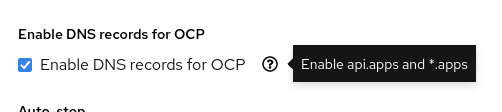

# ACM MIRROR REGISTRY AND ON PREM CLUSTERS

## TABLE OF CONTENTS

* [Introduction](#introduction)
* [Deploying OCP using vSpere IPI on a Connected Environment ](#deploying-ocp-using-vspere-ipi-on-a-connected-environment)
* [Infra Nodes During Cluster Deployment](#infra-nodes-during-cluster-deployment)
* [Adding An Infra Machine Set](#adding-an-infra-machine-set)
* [Replacing The Worker Machine Set](#replacing-the-worker-machine-set)


## Introduction

This documents is specific for deploying components in the [demo.redhat.com](https://demo.redhat.com) platform.

This project provides instructions on how to install a Management cluster using vsphere IPI method, in both a connected and disconnected environments.

There is a section on the creation and use of Infra nodes.

The installation and configuration of the mirror registry is explained for the case of the disconnected environment installation. 

The de ployment of managed OCP clusters through ACM "on premisses" has its own section

## Deploying OCP using vSpere IPI on a Connected Environment 

Create a **VMware Cloud Public Cloud Open Environment** in [demo.redhat.com](https://demo.redhat.com). 


The environment will be used to deploy an IPI OCP 4.14 cluster hub cluster.

Make sure to enable DNS records creation for OCP. when ordering the environment



It takes about 20 minutes for the environment to be provisioned and ready.
When the environment is ready, an email is received with information on how to access and use it.

Ssh into the bastion node and verify the DNS records for the cluster.  The IPs associated with the API and wildcard \*.apps are public, but they are NATed to internal private IPs in the environment, this is specified in the email received from RHDP:

```
$ dig +short api.glnm2.dynamic.opentlc.com
3.223.59.140
$ dig +short *.apps.glnm2.dynamic.opentlc.com
34.198.235.139
```
Get the installer, oc client and pull secret from [the Red Hat Console](https://console.redhat.com/openshift/install) and copy them to the bastion host. 

Uncompress the tar files and put them in the running path:

```
$ scp ~/Descargas/openshift-* /home/jjerezro/Descargas/pull-secret.txt   \
  lab-user@bastion-glnm2.glnm2.dynamic.opentlc.com

$ tar xvf openshift-client-linux.tar.gz
README.md
oc
kubectl

$ tar xvf openshift-install-linux.tar.gz
README.md
openshift-install

$ sudo cp -vi openshift-install oc /usr/local/bin
'openshift-install' -> '/usr/local/bin/openshift-install'
'oc' -> '/usr/local/bin/oc'
```

Create an ssh key pair.

```
$ ssh localhost
The authenticity of host 'localhost (::1)' can't be established.
ECDSA key fingerprint is SHA256:AIOgCA9BvbsRJN9NSt0jqJ6xEd4pjlcqyHPwF9aLr3Q.
Are you sure you want to continue connecting (yes/no/[fingerprint])? yes
Warning: Permanently added 'localhost' (ECDSA) to the list of known hosts.
lab-user@localhost's password:

$ ssh-keygen -t ed25519 -N '' -f ~/.ssh/ocp
Generating public/private ed25519 key pair.
Your identification has been saved in /home/lab-user/.ssh/ocp.
Your public key has been saved in /home/lab-user/.ssh/ocp.pub.
The key fingerprint is:
...
```

Download the vCenter’s root CA certificates.  Go to the vCenter's base URL, for example **https://portal.vc.opentlc.com/** Click on the link **Download trusted root CA certificates** on the right side of the web page


Copy the downloaded file to the bastion host and extract the compressed file:

```
$ scp download.zip lab-user@bastion-6lzvs.6lzvs.dynamic.opentlc.com:
lab-user@bastion-6lzvs.6lzvs.dynamic.opentlc.com's password: 
download.zip                                                                                                                                                100%   29KB 268.9KB/s   00:00 

bastion$ unzip download.zip
Archive:  download.zip
  inflating: certs/lin/7255df92.0    
  inflating: certs/mac/7255df92.0    
  inflating: certs/win/7255df92.0.crt  
  inflating: certs/lin/75c43eb5.r0   
  inflating: certs/mac/75c43eb5.r0   
  inflating: certs/win/75c43eb5.r0.crl
...
```

Update the bastion's system trust so the vCenter root CA certificates are recognized as valid:

```
$ sudo cp -vi certs/lin/* /etc/pki/ca-trust/source/anchors
'certs/lin/02265526.0' -> '/etc/pki/ca-trust/source/anchors/02265526.0'
'certs/lin/2835d715.0' -> '/etc/pki/ca-trust/source/anchors/2835d715.0'
...

$ sudo update-ca-trust extract
```

Create the install-config.yaml file. 

This repository contains a reference install-config.yaml file for a connected vSphere IPI installation at **IPI/Orig-install-config.yaml**

To create the initial configuration file use the following command.  The information required is in the email from RHDP.  For the VIP for API and Ingress use the NAT IP described in the email. The cluster name is the GUID described in the same email.

```
$ openshift-install create install-config
? SSH Public Key /home/lab-user/.ssh/ocp.pub
? Platform vsphere
? vCenter vcenter.sddc-44-197-86-61.vmwarevmc.com
? Username sandbox-glnm2@vc.opentlc.com
? Password [? for help] ************
INFO Connecting to vCenter vcenter.sddc-44-197-86-61.vmwarevmc.com
INFO Defaulting to only available datacenter: SDDC-Datacenter
INFO Defaulting to only available cluster: /SDDC-Datacenter/host/Cluster-1
INFO Defaulting to only available datastore: /SDDC-Datacenter/datastore/WorkloadDatastore
INFO Defaulting to only available network: segment-sandbox-glnm2
? Virtual IP Address for API 192.168.95.201
? Virtual IP Address for Ingress 192.168.95.202
? Base Domain dynamic.opentlc.com
? Cluster Name glnm2
? Pull Secret [? for help] ***************************...
INFO Install-Config created in: .
```

The provided vCenter user does not have enough privileges to create its own folders, but one is created by environment provisioning system and communicated in the email from RHDP.  Edit the resulting install-config.yaml file and add the vcenter folder where the VMs will be created. Use the prefix /SDDC-Datacenter/vm/.
```
...
platform:
  vsphere:
	apiVIPs:
	- 192.168.95.201
	failureDomains:
	- name: generated-failure-domain
  	region: generated-region
  	server: vcenter.sddc-44-197-86-61.vmwarevmc.com
  	topology:
    	computeCluster: /SDDC-Datacenter/host/Cluster-1
    	datacenter: SDDC-Datacenter
    	datastore: /SDDC-Datacenter/datastore/WorkloadDatastore
    	networks:
    	- segment-sandbox-glnm2
    	resourcePool: /SDDC-Datacenter/host/Cluster-1//Resources
    	folder: /SDDC-Datacenter/vm/Workloads/sandbox-glnm2
  	zone: generated-zone
...
```
Create a directory with the name of the cluster in the bastion host and copy the install-config.yaml file there:
```
$ mkdir glnm2
$ cp install-config.yaml glnm2/
```

Run the installer
```
$ openshift-install create cluster --dir glnm2/
INFO Consuming Install Config from target directory
INFO Creating infrastructure resources...    	 
INFO Waiting up to 20m0s (until 3:21AM EST) for the Kubernetes API at https://api.glnm2.dynamic.opentlc.com:6443...
INFO API v1.28.6+6216ea1 up                  	 
INFO Waiting up to 1h0m0s (until 4:04AM EST) for bootstrapping to complete...
INFO Destroying the bootstrap resources...   	 
INFO Waiting up to 40m0s (until 3:58AM EST) for the cluster at https://api.glnm2.dynamic.opentlc.com:6443 to initialize...
INFO Waiting up to 30m0s (until 4:03AM EST) to ensure each cluster operator has finished progressing...
INFO All cluster operators have completed progressing
INFO Checking to see if there is a route at openshift-console/console...
INFO Install complete!                       	 
INFO To access the cluster as the system:admin user when using 'oc', run 'export KUBECONFIG=/home/lab-user/glnm2/auth/kubeconfig'
INFO Access the OpenShift web-console here: https://console-openshift-console.apps.glnm2.dynamic.opentlc.com
INFO Login to the console with user: "kubeadmin", and password: "7azGi-RUI6u-HR8ph-PuRyH"
INFO Time elapsed: 36m40s
```

## Infra Nodes During Cluster Deployment

[Infra](https://access.redhat.com/solutions/5034771) nodes can be used to isolate infrastructure workloads for two primary purposes:

   1. To prevent incurring billing costs against subscription counts.
   1. To separate maintenance and management.

Infra nodes can be created during cluster deployment or post cluster deployment. 

To have infra nodes created at cluster deployment, start by creating the manifests from the install-config.yaml file.

```
$ openshift-install create manifests --dir glnm2/
INFO Consuming Install Config from target directory
INFO Manifests created in: glnm2/manifests and glnm2/openshift
```

One of the manifests defines the worker machineset
```
$ ls glnm2/openshift/*machineset*
glnm2/openshift/99_openshift-cluster-api_worker-machineset-0.yaml
```
### Adding An Infra Machine Set

In this example a new machineset for infra nodes is created, resulting in 2 machinesets: one for workers and one for infra. See later for an example in which the worker machineset is replaced by an infra machineset.

Copy the worker machineset as the infra machineset

```
$ cd glnm2/openshift/

$ cp 99_openshift-cluster-api_worker-machineset-0.yaml \
  99_openshift-cluster-api_infra-machineset-0.yaml
```
Modify the infra machineset according to the [documentation.](https://docs.openshift.com/container-platform/4.13/machine_management/creating-infrastructure-machinesets.html#machineset-yaml-vsphere_creating-infrastructure-machinesets)  Replace all references to worker and put infra instead.

The amount of disk, CPU, and memory resources can be specified in the machineset definition. Keep the original value for **userDataSecret** referencing the worker user data

The final result looks like this:
```
apiVersion: machine.openshift.io/v1beta1
kind: MachineSet
metadata:
  creationTimestamp: null
  labels:
    machine.openshift.io/cluster-api-cluster: 6lzvs-xbd25
  name: 6lzvs-xbd25-infra-0
  namespace: openshift-machine-api
spec:
  replicas: 3
  selector:
    matchLabels:
      machine.openshift.io/cluster-api-cluster: 6lzvs-xbd25
      machine.openshift.io/cluster-api-machineset: 6lzvs-xbd25-infra-0
  template:
    metadata:
      labels:
        machine.openshift.io/cluster-api-cluster: 6lzvs-xbd25
        machine.openshift.io/cluster-api-machine-role: infra
        machine.openshift.io/cluster-api-machine-type: infra
        machine.openshift.io/cluster-api-machineset: 6lzvs-xbd25-infra-0
    spec:
      lifecycleHooks: {}
      metadata:
        labels:
          node-role.kubernetes.io/infra: ""
        taints:
          - key: node-role.kubernetes.io/infra
            effect: NoSchedule
      providerSpec:
        value:
          apiVersion: machine.openshift.io/v1beta1
          credentialsSecret:
            name: vsphere-cloud-credentials
          diskGiB: 120
          kind: VSphereMachineProviderSpec
          memoryMiB: 16384
          metadata:
            creationTimestamp: null
          network:
            devices:
            - networkName: segment-sandbox-6lzvs
          numCPUs: 4
          numCoresPerSocket: 4
          snapshot: ""
          template: 6lzvs-xbd25-rhcos-generated-region-generated-zone
          userDataSecret:
            name: worker-user-data
          workspace:
            datacenter: SDDC-Datacenter
            datastore: /SDDC-Datacenter/datastore/WorkloadDatastore
            folder: /SDDC-Datacenter/vm/Workloads/sandbox-6lzvs
            resourcePool: /SDDC-Datacenter/host/Cluster-1//Resources
            server: vcenter.sddc-44-197-86-61.vmwarevmc.com
```

Run the installer.
```
$ openshift-install create cluster --dir glnm2/
INFO Consuming OpenShift Install (Manifests) from target directory 
INFO Consuming Master Machines from target directory 
INFO Consuming Common Manifests from target directory 
INFO Consuming Worker Machines from target directory 
INFO Consuming Openshift Manifests from target directory 
INFO Creating infrastructure resources...         
INFO Waiting up to 20m0s (until 4:49AM EST) for the Kubernetes API at https://api.glnm2.dynamic.opentlc.com:6443... 
INFO API v1.28.6+6216ea1 up                       
INFO Waiting up to 1h0m0s (until 5:32AM EST) for bootstrapping to complete... 
INFO Destroying the bootstrap resources...        
INFO Waiting up to 40m0s (until 5:29AM EST) for the cluster at https://api.glnm2.dynamic.opentlc.com:6443 to initialize... 
INFO Waiting up to 30m0s (until 5:32AM EST) to ensure each cluster operator has finished progressing... 
INFO All cluster operators have completed progressing 
INFO Checking to see if there is a route at openshift-console/console... 
INFO Install complete!                            
INFO To access the cluster as the system:admin user when using 'oc', run 'export KUBECONFIG=/home/lab-user/glnm2/auth/kubeconfig' 
INFO Access the OpenShift web-console here: https://console-openshift-console.apps.glnm2.dynamic.opentlc.com 
INFO Login to the console with user: "kubeadmin", and password: "RLAiW-c83BZ-9SiAU-89pWa" 
INFO Time elapsed: 38m14s
```
The resulting cluster has 3 worker and 3 infra nodes, but the infra services are running on the worker nodes because those infra services don’t have the matching tolerations to run on the infra nodes.  This must be taken into account if the cluster does not have any worker nodes.

```
$ oc get nodes
NAME                         STATUS   ROLES                  AGE   VERSION
6lzvs-xbd25-master-0         Ready    control-plane,master   35m   v1.28.6+6216ea1
6lzvs-xbd25-master-1         Ready    control-plane,master   35m   v1.28.6+6216ea1
6lzvs-xbd25-master-2         Ready    control-plane,master   34m   v1.28.6+6216ea1
6lzvs-xbd25-infra-0-75cmf    Ready    infra,worker           16m   v1.28.6+6216ea1
6lzvs-xbd25-infra-0-kbfrh    Ready    infra,worker           16m   v1.28.6+6216ea1
6lzvs-xbd25-infra-0-rm524    Ready    infra,worker           16m   v1.28.6+6216ea1
6lzvs-xbd25-worker-0-ngrlc   Ready    worker                 16m   v1.28.6+6216ea1
6lzvs-xbd25-worker-0-np8q8   Ready    worker                 16m   v1.28.6+6216ea1
6lzvs-xbd25-worker-0-t8lml   Ready    worker                 16m   v1.28.6+6216ea1

$ oc get machineset -n openshift-machine-api
NAME                   DESIRED   CURRENT   READY   AVAILABLE   AGE
6lzvs-xbd25-infra-0    3         3         3       3           39m
6lzvs-xbd25-worker-0   3         3         3       3           39m
```

### Replacing The Worker Machine Set

In case of a cluster in which no worker nodes are needed because only infra workloads are going to be executed, replace the worker machineset by an infra machineset and leave the taint out of the infra nodes.

After creating the manifests as described in section [Adding An Infra Machine Set](#adding-an-infra-machine-set), rename the file defining the worker machineset and edit it.    Keep the original value for **userDataSecret** referencing the worker user data.

The machineset definition does not contain any [taints](https://kubernetes.io/docs/concepts/scheduling-eviction/taint-and-toleration/).  If there were any taints with the NoSchedule or NoExecute effect, the installation would not complete successfully because the infrastructure worloads created during installation don't have the corresponding tolerations.  The tainst are not needed because this cluster does not have any worker nodes and therefore no user workloads are expected here.

```
$ mv 99_openshift-cluster-api_worker-machineset-0.yaml \
   99_openshift-cluster-api_infra-machineset-0.yaml

$ vim 99_openshift-cluster-api_infra-machineset-0.yaml
apiVersion: machine.openshift.io/v1beta1
kind: MachineSet
metadata:
  creationTimestamp: null
  labels:
    machine.openshift.io/cluster-api-cluster: 6lzvs-2czxc
  name: 6lzvs-2czxc-infra-0
  namespace: openshift-machine-api
spec:
  replicas: 3
  selector:
    matchLabels:
      machine.openshift.io/cluster-api-cluster: 6lzvs-2czxc
      machine.openshift.io/cluster-api-machineset: 6lzvs-2czxc-infra-0
  template:
    metadata:
      labels:
        machine.openshift.io/cluster-api-cluster: 6lzvs-2czxc
        machine.openshift.io/cluster-api-machine-role: infra
        machine.openshift.io/cluster-api-machine-type: infra
        machine.openshift.io/cluster-api-machineset: 6lzvs-2czxc-infra-0
    spec:
      lifecycleHooks: {}
      metadata:
        labels:
          node-role.kubernetes.io/infra: ""
      providerSpec:
        value:
          apiVersion: machine.openshift.io/v1beta1
          credentialsSecret:
            name: vsphere-cloud-credentials
          diskGiB: 120
          kind: VSphereMachineProviderSpec
          memoryMiB: 16384
          metadata:
            creationTimestamp: null
          network:
            devices:
            - networkName: segment-sandbox-6lzvs
          numCPUs: 4
          numCoresPerSocket: 4
          snapshot: ""
          template: 6lzvs-2czxc-rhcos-generated-region-generated-zone
          userDataSecret:
            name: worker-user-data
          workspace:
            datacenter: SDDC-Datacenter
            datastore: /SDDC-Datacenter/datastore/WorkloadDatastore
            folder: /SDDC-Datacenter/vm/Workloads/sandbox-6lzvs
            resourcePool: /SDDC-Datacenter/host/Cluster-1//Resources
            server: vcenter.sddc-44-197-86-61.vmwarevmc.com
```
Run the installer.
```
$ openshift-install create cluster --dir 6lzvs/
INFO Consuming OpenShift Install (Manifests) from target directory 
INFO Consuming Common Manifests from target directory 
INFO Consuming Openshift Manifests from target directory 
INFO Consuming Worker Machines from target directory 
INFO Consuming Master Machines from target directory 
INFO Creating infrastructure resources...         
INFO Waiting up to 20m0s (until 3:49PM EDT) for the Kubernetes API at https://api.6lzvs.dynamic.opentlc.com:6443... 
INFO API v1.28.6+6216ea1 up                       
INFO Waiting up to 1h0m0s (until 4:32PM EDT) for bootstrapping to complete... 
INFO Destroying the bootstrap resources...        
INFO Waiting up to 40m0s (until 4:27PM EDT) for the cluster at https://api.6lzvs.dynamic.opentlc.com:6443 to initialize... 
INFO Waiting up to 30m0s (until 4:32PM EDT) to ensure each cluster operator has finished progressing... 
INFO All cluster operators have completed progressing 
INFO Checking to see if there is a route at openshift-console/console... 
INFO Install complete!                            
INFO To access the cluster as the system:admin user when using 'oc', run 'export KUBECONFIG=/home/lab-user/6lzvs/auth/kubeconfig' 
INFO Access the OpenShift web-console here: https://console-openshift-console.apps.6lzvs.dynamic.opentlc.com 
INFO Login to the console with user: "kubeadmin", and password: "ByXfw-psGGg-j6nba-F55Pd" 
INFO Time elapsed: 37m8s
```
The deployed cluster has 3 masters and 3 infras, no workers, and a single machineset for the infra nodes.
```
$ oc get nodes
NAME                        STATUS   ROLES                  AGE   VERSION
6lzvs-2czxc-infra-0-jpg2w   Ready    infra,worker           10h   v1.28.6+6216ea1
6lzvs-2czxc-infra-0-vclbd   Ready    infra,worker           10h   v1.28.6+6216ea1
6lzvs-2czxc-infra-0-x77tg   Ready    infra,worker           10h   v1.28.6+6216ea1
6lzvs-2czxc-master-0        Ready    control-plane,master   11h   v1.28.6+6216ea1
6lzvs-2czxc-master-1        Ready    control-plane,master   11h   v1.28.6+6216ea1
6lzvs-2czxc-master-2        Ready    control-plane,master   11h   v1.28.6+6216ea1

$ oc get machineset -n openshift-machine-api
NAME                  DESIRED   CURRENT   READY   AVAILABLE   AGE
6lzvs-2czxc-infra-0   3         3         3       3           11h
```
The infra workloads are running in the infra nodes because there are not taints assigned to those nodes, so tolerations are not required:
```
$ oc get pods -n openshift-ingress -o wide
NAME                              READY   STATUS    RESTARTS   AGE   IP               NODE                        NOMINATED NODE   READINESS GATES
router-default-54f47c8bb9-vddkp   1/1     Running   0          11h   192.168.74.145   6lzvs-2czxc-infra-0-vclbd   <none>           <none>
router-default-54f47c8bb9-zjlpr   1/1     Running   0          11h   192.168.74.77    6lzvs-2czxc-infra-0-jpg2w   <none>           <none>
```


If this is a disconnected installation, follow the instructions in section Mirror Registry to install the local registry and mirror the installation images.

